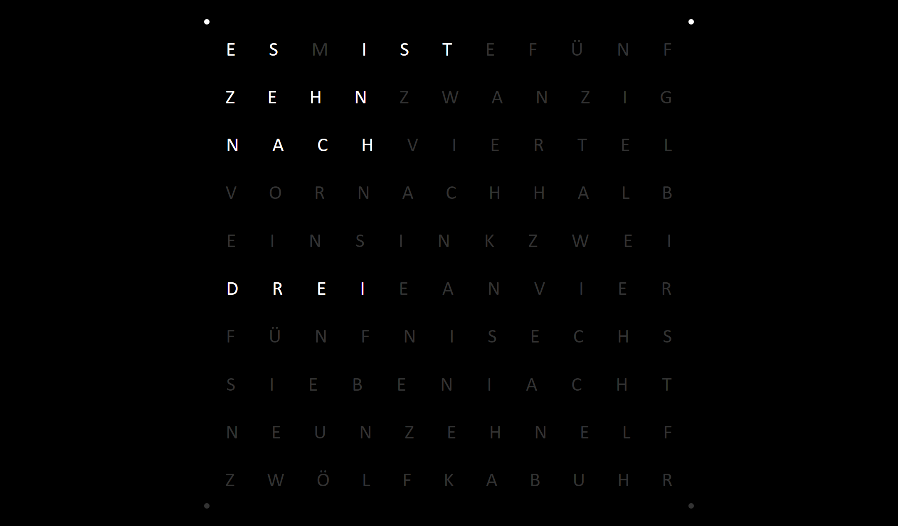

# Wordclock

This is a wordclock designed to run in a browser. It is developed and tested for Chrome, but other browsers work too if they support all necessary features.

@Copyright: Raphael Höser (Snapstromegon)

## Developer Notes

### This GIT

If you encouter any bugs or want to improve or contribute, please feel free to do so via issues or PRs.

### Sprachpakete

If you want to add a languagepack to my system, feel free to add a PR.

#### Übersicht über verfügbare Sprachpakete

| Language       |  Code   | wc_langPack            |
| :------------- | :-----: | :--------------------- |
| German         |   DE    | wc_langPack_DE.js      |
| English        |   EN    | wc_langPack_EN.js      |
| Dutch          |   NL    | wc_langPack_NL.js      |
| Swiss German   | DE_SWG  | wc_langPack_DE_SWG.js  |
| Bernese German | CH_BERN | wc_langPack_CH_BERN.js |

## Screenshot



## Installation

### Files

The following files are needed for this clock to run:

- **./wc.html**  
  The HTML base for the clock
- **./wc_main.js**  
  Main logik which is not language specific
- **./wc_base.css**  
  styling of the clock
- **./wc\_langPacks/wc\_langPack\_[language_code].js**  
  The Languagepack you want to use

### Displaying System

Just open **wc.html** to see the wordclock.

## Customization

### Settings

In **wc_main.js** you can edit the _wc_settings_ Object with the following attributes:

- **lang**:  
  the language code you want to use (default: 'DE')
- **updateInterval**:  
  how often the main loop should run and update the clock state (default: every 1000ms)
- **round**:  
  set this to true, of you want to round the time to the closest five minutes (for usage without the minute points) (default: false)
- **showMinutePoints**:  
  set this to false to hide the minute points (default: true)
- **stencilMode**:  
  this mode only shows bright squares instead of the letters, so you can add a cardboard cutout on the monitor (default: false)
- **fuzzyTime**:  
  this adds an additional part to the wording like 01:32 -> "it just was half past one" or 01:28 -> "it is nearly half past one". This comes up, so it always shows the closest 5 minute interval. (default: none)
  possible values are none, before (for nearly), after (for just was) and both.
  This feature is only implemented for the following language packs:
    - EN

#### Default Settings

```javascript
var wc_settings = {
  lang: 'DE',
  updateInterval: 1000,
  round: false,
  showMinutePoints: true,
  stencilMode: false,
  fuzzyTime: 'none',
};
```

### Style

The root element sets three css variables, which control the color theme, the minute point distance and the fontsize.

#### Default Style

```css
:root {
  --on-color: #fff;
  --off-color: #333;
  --background-color: #000;
  --dot-padding: 4%;
  --fontSize: 2em;
}
```

### Custom Languagepacks

#### Description

You can add custom language packs to the _wc_langPacks_ folder. Those have to follow the structure of the existing packets and do/provide the following things:

#### Register

A languagepack has to call the global function `wc_addLanguagePack(languagePack)` to register itself.

#### Languagepack content

A languagpack has to provide the following attributes:

- **langCode**:  
  The language code
- **letterSet**:  
  A two dimensional character array in which the first dimension describes a row and the second the columns in a row.
- **timeString**:
  A function in the form of `function(h,m,settings)`, which gets the following parameters and returns a string which words can be found from top left to bottom right in the _letterSet_.

  **Parameters**

  - **h**  
    Current hours in 24h-format
  - **m**  
    Current minutes between 0 and 59
  - **settings**
    A Settingsobject, which holds information about the current clock settings.

## Inspiration

The inspiration for this project was a request my father made (github: ThomasH-W). In his Blog (german) you can find a more detailed install guide and further projects..
